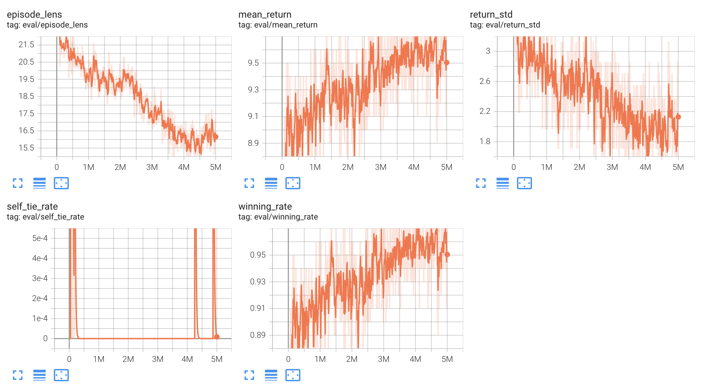

# MAFS5370: Reinforcement Learning for the Super Tic-Tac-Toe

A simple implementation of self-play for the game *Super Tic-Tac-Toe*. In *Super Tic-Tac-Toe*, the 
board is of size 6x6, and the player who occupies 4-successive positions in row, column or diagonally
wins. Each move has a stochastic outcome: with probability=0.5 the action is accepted, otherwise the action is 
randomly placed in the available neighbor cells if possible. 


The default demonstration is a 
[Double DQN](https://arxiv.org/abs/1509.06461v3) agent.
Run the following code for self-play training and evaluation (the default testing opponents is a random agent, you can 
replace it to be any pre-trained agent):
```
python main.py
```

The recorded statistics of training/evaluation process can be visualized using tensorboard in your terminal:
```
tensorboard --logdir results/tensorboard
```

Here is an example of training 10,000,000 environment steps (around 1 hr on a single RTX 4090). The winning rate
against the random agent achieves over 90% and the performance still improves with even more training steps.


The neural networks are built upon the Google's [jax](https://jax.readthedocs.io/en/latest/installation.html) and 
[flax](https://flax.readthedocs.io/en/latest/index.html) framework with cuda GPU support.


You can refer to [tutorial.ipynb](tutorial.ipynb) for a detailed illustration of methods and codes.

Have fun!

